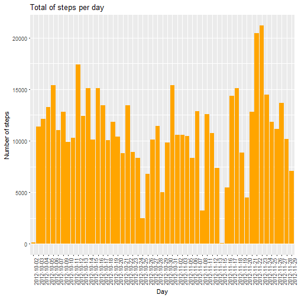
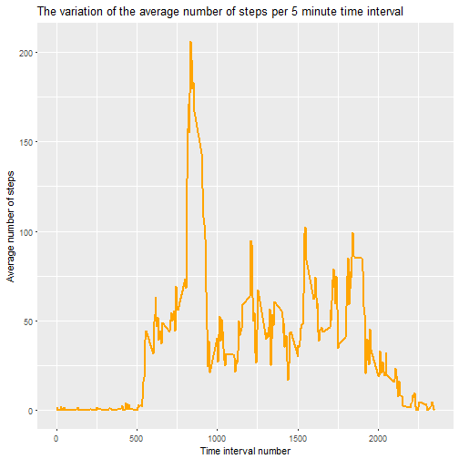
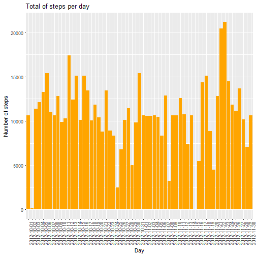
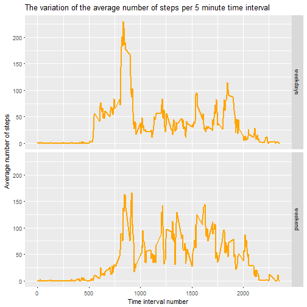

# Course Project 1

## Introduction

It is now possible to collect a large amount of data about personal movement using activity monitoring devices such as a Fitbit, Nike Fuelband, or Jawbone Up. These type of devices are part of the “quantified self” movement – a group of enthusiasts who take measurements about themselves regularly to improve their health, to find patterns in their behavior, or because they are tech geeks. But these data remain under-utilized both because the raw data are hard to obtain and there is a lack of statistical methods and software for processing and interpreting the data.

This assignment makes use of data from a personal activity monitoring device. This device collects data at 5 minute intervals through out the day. The data consists of two months of data from an anonymous individual collected during the months of October and November, 2012 and include the number of steps taken in 5 minute intervals each day.


## Data

The data for this assignment will be downloaded from the course web site:

Dataset: Activity monitoring data [52K]
The variables included in this dataset are:

* steps: Number of steps taking in a 5-minute interval (missing values are coded as NA)
* date: The date on which the measurement was taken in YYYY-MM-DD format
* interval: Identifier for the 5-minute interval in which measurement was taken

### Loading and processing the data

Step 1. Downloading the required file:


```r
fileurl<-"http://d396qusza40orc.cloudfront.net/repdata%2Fdata%2Factivity.zip"
file.info(fileurl)

if(!exists("Activity_monitoring_data.zip")){
        download.file(fileurl,"Activity_monitoring_data.zip",method = "curl")
}
```

Step 2. Decompressing the file:


```r
if(!exists(c("activity.csv"))){
        unzip("Activity_monitoring_data.zip")
}
```

Step 3. Bringing the data into R:


```r
if(!exists("activitydata")){
        activitydata <- read.csv("activity.csv")
}
```
Step 4. Preview the data


```r
head(activitydata)
```

```
##   steps       date interval
## 1    NA 2012-10-01        0
## 2    NA 2012-10-01        5
## 3    NA 2012-10-01       10
## 4    NA 2012-10-01       15
## 5    NA 2012-10-01       20
## 6    NA 2012-10-01       25
```

Step 5. Transforming the date variable from factor into date type using "lubridate" and "dplyr" packages. (I also loaded the package "ggplot2" for future plots)


```r
library(lubridate)
library(dplyr)
library(ggplot2)
```


```r
activitydata<-mutate(activitydata,date=ymd(paste(date)))
str(activitydata)
```

```
## 'data.frame':	17568 obs. of  3 variables:
##  $ steps   : int  NA NA NA NA NA NA NA NA NA NA ...
##  $ date    : Date, format: "2012-10-01" "2012-10-01" ...
##  $ interval: int  0 5 10 15 20 25 30 35 40 45 ...
```

1. Calculate the total number of steps taken per day

```r
totalstepsperday<-aggregate(steps~date,data = activitydata,sum)
head(totalstepsperday)
```

```
##         date steps
## 1 2012-10-02   126
## 2 2012-10-03 11352
## 3 2012-10-04 12116
## 4 2012-10-05 13294
## 5 2012-10-06 15420
## 6 2012-10-07 11015
```

2. Plot the histogram with the total number of steps taken per day


```r
with(totalstepsperday,
     ggplot(totalstepsperday,aes(as.factor(date),steps))
     + geom_histogram(stat = "identity",fill ="orange")
     + theme(axis.text.x = element_text(angle=90, hjust=1))
     + xlab("Day") 
     + ylab("Number of steps") 
     + ggtitle("Total of steps per day")
     )
```



3. Here is the code to calculate the mean and the median number of steps per day.


```r
meannumberofsteps<-round(mean(totalstepsperday$steps),0)
mediannumberofsteps<-round(median(totalstepsperday$steps),0)
```

The mean number of steps taken per day is **10766** and the median number of steps per day is **10765** .

4. Aggregate the steps by 5 minute time interval:


```r
avgstepsperinterval<-aggregate(steps~interval,data = activitydata,mean)
str(avgstepsperinterval)
```

```
## 'data.frame':	288 obs. of  2 variables:
##  $ interval: int  0 5 10 15 20 25 30 35 40 45 ...
##  $ steps   : num  1.717 0.3396 0.1321 0.1509 0.0755 ...
```

```r
head(avgstepsperinterval)
```

```
##   interval     steps
## 1        0 1.7169811
## 2        5 0.3396226
## 3       10 0.1320755
## 4       15 0.1509434
## 5       20 0.0754717
## 6       25 2.0943396
```

```r
tail(avgstepsperinterval)
```

```
##     interval     steps
## 283     2330 2.6037736
## 284     2335 4.6981132
## 285     2340 3.3018868
## 286     2345 0.6415094
## 287     2350 0.2264151
## 288     2355 1.0754717
```

5. Plotting the the time series of the 5 minute interval and the average number of steps taken, averaged across all days:


```r
with(avgstepsperinterval,
     ggplot(avgstepsperinterval,aes(x=as.integer(interval),y=steps))
     + geom_line(size=1, color ="orange")
     + xlab("Time interval number") 
     + ylab("Average number of steps") 
     + ggtitle("The variation of the average number of steps per 5 minute time interval")
     )
```



6. The code for determining the intarval that has the maximum number of steps is:

```r
maxstepsperinterval<-subset(avgstepsperinterval,steps==max(steps))
```

The number of the interval that has the most number of steps is **835** and the number of steps in that interval is **206** .

7. The code to calculate the number of records with missing data:


```r
recordsmissingdata<-sum(is.na(activitydata))
```

The number of records with missing data is **2304** .

8. The missing data will be replaced by the average number of steps for the coresponding interval. The replacement of the missing data will be done step by step:

Create the variable that contains the position in the original data that matches with the position in the average steps per time interval variable. It will be a map between the two variables a repetition of the numbers from 1 to 288.


```r
matchinterval<-match(activitydata$interval, avgstepsperinterval$interval)
head(matchinterval)
```

```
## [1] 1 2 3 4 5 6
```

```r
tail(matchinterval)
```

```
## [1] 283 284 285 286 287 288
```

Create a dummy variable that contains the average number of steps per time interval based on the previous mapping. This variable will have the same length with the original data but it will pair the average number of steps values with the coresponding interval in the original data :


```r
dummyaverage<-avgstepsperinterval$steps[matchinterval]
str(dummyaverage)
```

```
##  num [1:17568] 1.717 0.3396 0.1321 0.1509 0.0755 ...
```

Replace the missing data in the "steps" variable with the integer part of the average for the coresponding interval:


```r
cleanactivitydata <- mutate(activitydata,steps=if_else(is.na(steps),as.integer(dummyaverage),steps))
```


9. Apply steps 1 to 3 for "cleanactivitydata" set:

Calculate the total number of steps taken per day

```r
totalstepsperday2<-aggregate(steps~date,data = cleanactivitydata,sum)
head(totalstepsperday2)
```

```
##         date steps
## 1 2012-10-01 10641
## 2 2012-10-02   126
## 3 2012-10-03 11352
## 4 2012-10-04 12116
## 5 2012-10-05 13294
## 6 2012-10-06 15420
```

Plot the histogram with the total number of steps taken per day


```r
with(totalstepsperday2,
     ggplot(totalstepsperday2,aes(as.factor(date),steps))
     + geom_histogram(stat = "identity",fill ="orange")
     + theme(axis.text.x = element_text(angle=90, hjust=1))
     + xlab("Day") 
     + ylab("Number of steps") 
     + ggtitle("Total of steps per day")
     )
```



Here is the code to calculate the mean and the median number of steps per day.


```r
meannumberofsteps2<-round(mean(totalstepsperday2$steps),0)
mediannumberofsteps2<-round(median(totalstepsperday2$steps),0)
```

Having the NA values replaced we can see a small cahnge in the average and median. The new values are: mean= **10750** and median = **10641** .

10. Create the new variable "day" in the clean data set which will separate the records into two classes "weekdays" or "weekend".


```r
cleanactivitydata <- mutate(cleanactivitydata,
                            day=if_else(weekdays(date) %in% c("Saturday","Sunday"),"weekend","weekdays"))
table(cleanactivitydata$day)
```

```
## 
## weekdays  weekend 
##    12960     4608
```
11. Aggregate the steps by 5 minute time interval and day:


```r
avgstepsperintervalday<-aggregate(steps~interval+day,data = cleanactivitydata,mean)
str(avgstepsperintervalday)
```

```
## 'data.frame':	576 obs. of  3 variables:
##  $ interval: int  0 5 10 15 20 25 30 35 40 45 ...
##  $ day     : chr  "weekdays" "weekdays" "weekdays" "weekdays" ...
##  $ steps   : num  2.1556 0.4 0.1556 0.1778 0.0889 ...
```

```r
head(avgstepsperintervalday)
```

```
##   interval      day      steps
## 1        0 weekdays 2.15555556
## 2        5 weekdays 0.40000000
## 3       10 weekdays 0.15555556
## 4       15 weekdays 0.17777778
## 5       20 weekdays 0.08888889
## 6       25 weekdays 1.57777778
```

```r
tail(avgstepsperintervalday)
```

```
##     interval     day   steps
## 571     2330 weekend  1.3125
## 572     2335 weekend 11.5000
## 573     2340 weekend  6.2500
## 574     2345 weekend  1.6250
## 575     2350 weekend  0.0000
## 576     2355 weekend  0.1250
```

12. Create the panel plot with the data obtained in step 11 to show the differences in average number of steps taken per time interval between weekend and weekdays


```r
with(avgstepsperintervalday,
     ggplot(avgstepsperintervalday,aes(x=as.integer(interval),y=steps))
     + geom_line(size=1,color="orange") 
     + facet_grid(day~.)
     + xlab("Time interval number") 
     + ylab("Average number of steps") 
     + ggtitle("The variation of the average number of steps per 5 minute time interval")
)
```



We can notice that the average number of steps tends to be higher on the weekend days comparing with the weekdays with one exception between the interval 500 and 1000.
